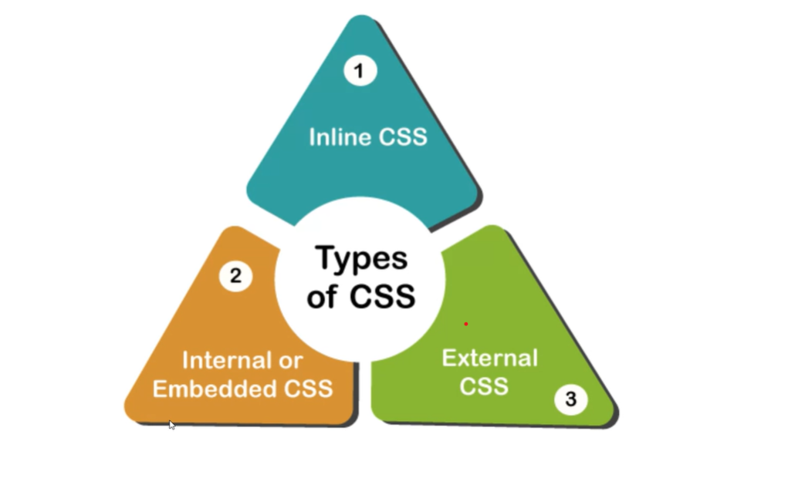
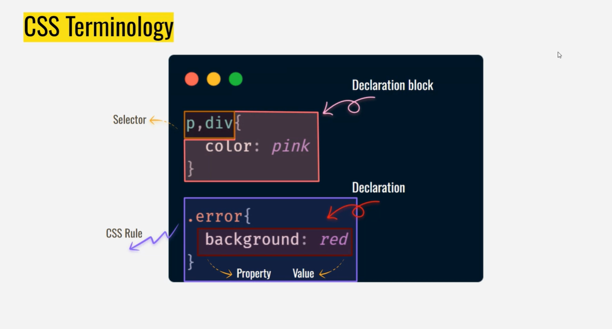
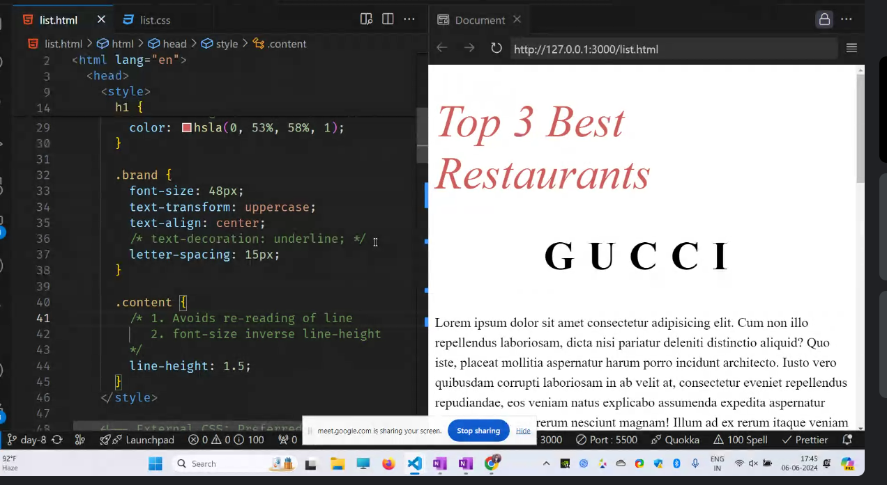

git rebase -i HEAD~3

1. what is CSS?

# CSS_Cascading Style Sheets

## Types of CSS:

- Inline CSS- due to seperation of concern

  - Inline CSS, or inline style, is a technique for applying a unique style to a single HTML element within the body of a webpage using the style attribute:
  
This actual text goes here.

  <h1 style=``color: red; font-size: 40px;''>Hello World</h1>

- Internal Or Embedded CSS-coloring a heading with head tags
  - /\* <!DOCTYPE html>
  <html>

<head> 
	<title>Internal CSS</title> 
	

</head>

<body>

    
A Computer Science Portal..!

</body>

</html> */
  - saves time to request css file and get it

- External CSS --prefered one, we can link that file to other html files

  

  ## CSS Terms

  

## Text Styling

1.  font-size
2.  font-weight --how thick you want the text to be
3.  font style --italic
4.  color --text color

### Color formats

1. name
2. rgb
3. HEX value-oldest -supports all
4. hsl(Hue, saturation, and lightness)--more human friendly
   - hue--color alone
   - saturation-- color poopoing up if saturation is high
   - lightness--adding white to the color
5. lch-not supported by rgb,better colors-have better color gamet-implemented 1st by safari
   srgb,dcpi,Adobe SRGB--other color gamut

## TextStyling -2

1. text transform--upper case,lower case
2. text-align
3. text decoration
4. letter-spacing-for brands like GUCCI
5. line-height->inversly proportional to font size

   - line height avoids rereading of lines

# Text Family

serif----for trust,tradational,serious,oldest,scured..(ex--paper,gold etc)
sans serif--- for other websites like tranding,chill etc

## Box Model:

> margin --
> border  
> padding --
> content

max-width--to avoid scrool bar when we zoom out it then text should come to next line
Note: Imporant

> 1vh=1% of screen height  
> 1vw=1% of screen width  
> width=1% of container width
> 1px=absolute
> 1% -relative
> Note: To change the color gradiently--generer a css color gradient--it will combine nd gives the color
> inline---occupy only content width (anchor tag ,span)
> bloch--will occupy entire width of the computer (heading ,paragraph elements)
> clip-path-->masking
